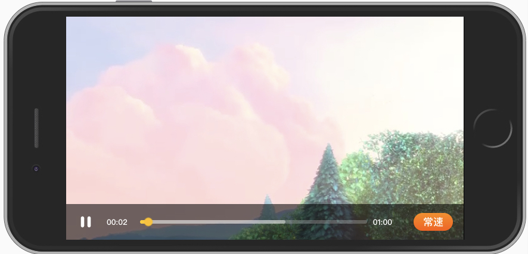

微信环境下，自定义视频播放器组件

## feature

- 始终横屏播放
- 自定义控制条
- android，ios微信亲测有效
- 支持webview



- 基于 [Create React App](https://github.com/facebook/create-react-app).

# 使用

## 本地部署

`npm start`

打开 [http://localhost:3000](http://localhost:3000)

## 打包

`npm run build`

## 自定义播放器的使用

video标签必须包含以下几个参数，使得video播放器为内联样式，满足微信内播放要求。
使用iframe监听宽高变化，自适应横竖屏

```jsx
<video
  id="video" 
  src="video.mp4" 
  poster="images.jpg"       // 视频封面
  preload="auto" 
  playsinline="true"        // IOS微信浏览器支持小窗内播放
  webkit-playsinline="true" // 这个属性是ios 10中设置可以，让视频在小窗内播放，也就是不是全屏播放 
  x5-video-player-type="h5" // 启用H5播放器,是微信安卓版特性
  x5-playsinline="true"     // 安卓微信浏览器支持小窗内播放
  x-webkit-airplay="allow"  // 这个属性使此视频支持ios的AirPlay功能 
  style="object-fit:fill"
</video>
```

### android横屏播放实现方案2：(全屏，仅android微信可用)
```jsx
<video
  id="video" 
  src="video.mp4" 
  poster="images.jpg"       // 视频封面
  preload="load"
  x5-video-player-type="h5" // 启用H5播放器,是微信安卓版特性
  x5-video-orientation="landscape"  // 播放器支持的方向， landscape横屏，portraint竖屏，默认值为竖屏
  x5-video-player-fullscreen="true" // 视频播放时将会进入到全屏模式
/>
```

### ios横屏播放实现方案2

给video标签包一层div，设置div监听宽高变化，宽<高时，旋转90°（这种方案实现效果不太好，进度条控制有问题）

```js
window.addEventListener('resize', this.handleWindowResize)
// 自适应横屏模式
handleWindowResize = () => {
  const {innerWidth, innerHeight} = window
  console.log('resize', innerWidth, innerHeight)
  this.setState({
    containerStyle: this.getContainerStyle()
  })

  const tempW = innerWidth
  const tempH = innerHeight

  const doubleCheck = () => {
    if (innerWidth !== tempW || innerHeight !== tempH)
      this.handleWindowResize()
  }
  setTimeout(doubleCheck, 100)
  setTimeout(doubleCheck, 500)
}

getContainerStyle() {
  const {innerWidth, innerHeight} = window
  return innerWidth > innerHeight
    ? {
        _isRotated: false,
        position: 'fixed',
        top: 0,
        left: 0,
        width: innerWidth,
        height: innerHeight,
        overflow: 'hidden'
      }
    : {
        _isRotated: true,
        position: 'fixed',
        top: 0,
        left: innerWidth,
        width: innerHeight,
        height: innerWidth,
        transform: 'rotate(90deg)',
        transformOrigin: '0 0',
      }
}
```

# 注意

- 如果要在ios的webview中执行

1. ios端app要设置`webConfig.allowsInlineMediaPlayback = YES`
2. video标签中要设置playsinline和webkit-playsinline
```html
<video
  playsInline
  preload="load"
  airplay="allow"
  x-webkit-airplay="allow"
  x5-video-player-type="h5"
  webkit-playsinline="true"
  x5-video-orientation="portrait"
/>
```
才能让视频播放器正常播放，否则点击播放会自动全局后使用ios自带的播放器，导致自定义的播放组件无效。


# 参考资料

1. https://x5.tencent.com/tbs/guide/video.html
2. https://segmentfault.com/a/1190000008782550
3. https://segmentfault.com/a/1190000009395289